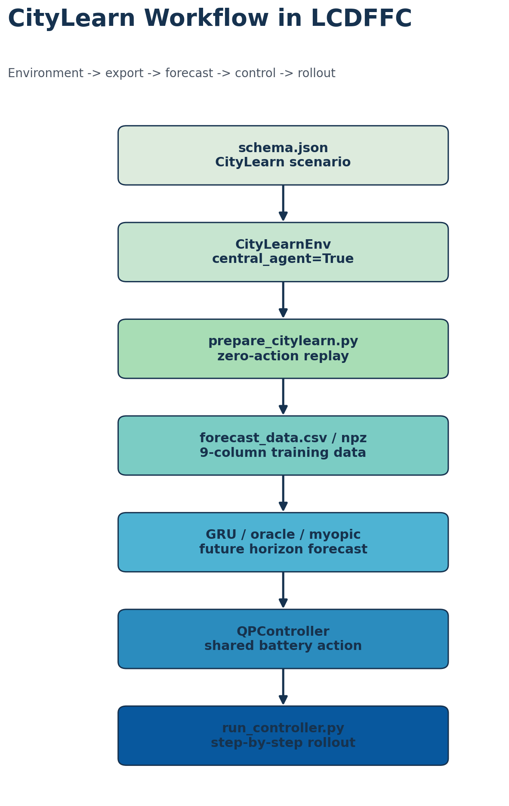
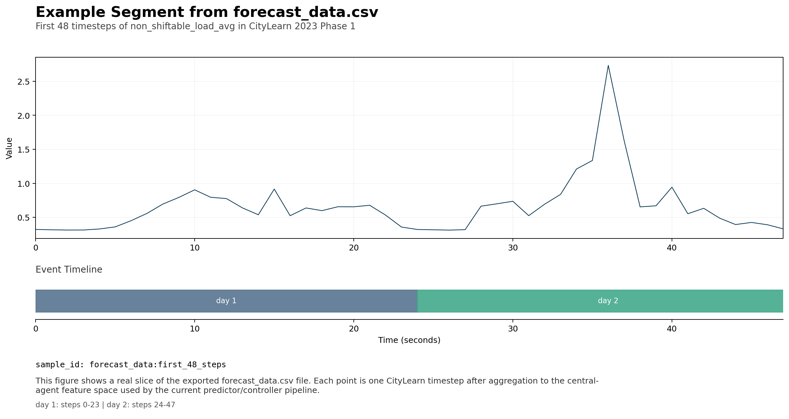

# CityLearn 平台使用说明与样例（2026-03-19）

## 当前结论

对于当前仓库，最需要掌握的不是 CityLearn 的全部功能，而是这四件事：

1. 如何从 `schema.json` 初始化 `CityLearnEnv`
2. `reset()` / `step()` 返回的数据结构到底长什么样
3. 如何把环境 observation 导出成 `forecast_data.csv / npz`
4. 一轮 episode 仿真和一轮带控制器的 rollout 大概需要多久

这份说明只围绕当前仓库已经验证过的真实路径展开。

## 项目目标

当前工程在 CityLearn 里做的是最小可用闭环：

- 用 `data/prepare_citylearn.py` 从环境回放导出数据
- 用 `scripts/train_gru.py` 训练预测器
- 用 `eval/run_controller.py` 在环境中做滚动控制
- 用 `eval/run_rbc.py` 做基线对比

## 工作流图



## CityLearn 在当前仓库里怎么被使用

### 1. 初始化环境

```python
from citylearn.citylearn import CityLearnEnv

schema = "/cluster/home/user1/.cache/citylearn/v2.5.0/datasets/citylearn_challenge_2023_phase_1/schema.json"
env = CityLearnEnv(schema=schema, central_agent=True)
```

这里最重要的参数是：

- `schema`：场景定义文件
- `central_agent=True`：当前仓库假设一个中央控制器统一控制多栋建筑

### 2. 读取 observation

```python
obs = env.reset()
```

当前版本下真实结构是：

```text
type(obs) = tuple
len(obs) = 2
type(obs[0]) = list
len(obs[0]) = 1
type(obs[0][0]) = list
len(obs[0][0]) = 49
```

也就是说，当前中央 agent 的 49 维 observation 真正位于 `obs[0][0]`。

### 3. 与环境交互

最小一步控制：

```python
action = [[0.0] * len(env.action_names[0])]
next_obs, reward, terminated, truncated, info = env.step(action)
```

当前环境里：

- `reward` 是 list，例如 `[-0.3023834228515625]`
- `terminated` / `truncated` 决定 episode 是否结束
- `info` 是 dict

## 原始数据和导出数据的格式

### 环境规模

当前本地缓存的 2023 Phase 1 数据规模：

```json
{
  "schema": "citylearn_challenge_2023_phase_1",
  "num_buildings": 3,
  "time_steps": 720,
  "num_features": 49
}
```

电池参数：

```json
[
  {"capacity": 4.0, "efficiency": 0.95, "nominal_power": 3.32},
  {"capacity": 4.0, "efficiency": 0.95, "nominal_power": 3.32},
  {"capacity": 3.3, "efficiency": 0.96, "nominal_power": 1.61}
]
```

### 原始 observation 样例

前 20 个 observation 名称：

```text
[
  'day_type', 'hour', 'outdoor_dry_bulb_temperature',
  'outdoor_dry_bulb_temperature_predicted_1',
  'outdoor_dry_bulb_temperature_predicted_2',
  'outdoor_dry_bulb_temperature_predicted_3',
  'diffuse_solar_irradiance',
  'diffuse_solar_irradiance_predicted_1',
  'diffuse_solar_irradiance_predicted_2',
  'diffuse_solar_irradiance_predicted_3',
  'direct_solar_irradiance',
  'direct_solar_irradiance_predicted_1',
  'direct_solar_irradiance_predicted_2',
  'direct_solar_irradiance_predicted_3',
  'carbon_intensity',
  'indoor_dry_bulb_temperature',
  'non_shiftable_load',
  'solar_generation',
  'dhw_storage_soc',
  'electrical_storage_soc'
]
```

初始 observation 前 20 个值样例：

```text
[5.0, 1.0, 24.66, 24.910639, 38.415958, 27.611464, 0.0, 54.625927,
 116.842888, 0.0, 0.0, 143.324341, 1020.756104, 0.0, 0.402488,
 23.098652, 0.356839, 0.0, 0.0, 0.2]
```

### 当前 action 槽位

当前是 3 栋楼，每栋楼有 3 个动作槽位，所以 `action_names` 是：

```text
[
  'dhw_storage', 'electrical_storage', 'cooling_device',
  'dhw_storage', 'electrical_storage', 'cooling_device',
  'dhw_storage', 'electrical_storage', 'cooling_device'
]
```

所以虽然是 `central_agent=True`，action 仍然是一个包含 9 个槽位的嵌套 list。

### 导出的 `forecast_data.csv`

当前训练器和控制器真正使用的是压缩后的 9 列数据：

1. `day_type`
2. `hour`
3. `outdoor_dry_bulb_temperature`
4. `carbon_intensity`
5. `electricity_pricing`
6. `non_shiftable_load_avg`
7. `solar_generation_avg`
8. `electrical_storage_soc_avg`
9. `net_electricity_consumption_avg`

前 5 行真实样例：

```text
 day_type  hour  outdoor_dry_bulb_temperature  carbon_intensity  electricity_pricing  non_shiftable_load_avg  solar_generation_avg  electrical_storage_soc_avg  net_electricity_consumption_avg
      5.0   1.0                         24.66          0.402488              0.02893                0.322084                   0.0                         0.2                         0.476122
      5.0   2.0                         24.07          0.382625              0.02893                0.316666                   0.0                         0.0                         0.000000
      5.0   3.0                         23.90          0.369458              0.02893                0.313329                   0.0                         0.0                         0.000000
      5.0   4.0                         23.87          0.367017              0.02893                0.313679                   0.0                         0.0                         0.000000
      5.0   5.0                         23.83          0.374040              0.02893                0.328668                   0.0                         0.0                         0.000000
```

### 一个真实时间片段的图示

下图展示的是 `forecast_data.csv` 中 `non_shiftable_load_avg` 前 48 个 timestep 的真实片段：



## 当前仓库里怎么做仿真

### 零动作基线仿真

```bash
python eval/run_rbc.py \
  --schema /cluster/home/user1/.cache/citylearn/v2.5.0/datasets/citylearn_challenge_2023_phase_1/schema.json \
  --output_dir reports/
```

逻辑是：

1. 初始化环境
2. 构造全零动作
3. `env.step(zero_action)` 跑完整个 episode
4. 从 `env.buildings` 读取 `net_electricity_consumption / pricing / carbon_intensity`
5. 聚合成 `cost / carbon / peak / ramping`

### 带控制器的仿真

```bash
python eval/run_controller.py \
  --schema /cluster/home/user1/.cache/citylearn/v2.5.0/datasets/citylearn_challenge_2023_phase_1/schema.json \
  --checkpoint artifacts/checkpoints/gru_mse_best.pt \
  --norm_stats artifacts/norm_stats.npz \
  --forecast_config configs/forecast.yaml \
  --controller_config configs/controller.yaml \
  --output_dir reports/ \
  --tag learned_qp \
  --forecast_mode learned \
  --device cpu
```

逻辑是：

1. 从环境 observation 提取 9 维特征
2. 构造历史窗口
3. 跑 `GRU / oracle / myopic` forecast
4. 把 forecast 喂给 `QPController`
5. 得到共享电池动作
6. 广播到 3 栋楼的 `electrical_storage` 槽位
7. `env.step(action)` 进入下一时刻

## 一轮控制要多久

以下数字是在当前机器、CPU、当前本地缓存 schema 上测得的真实值。

| 场景 | 总步数 | 总耗时 | 平均每步 |
|---|---:|---:|---:|
| `run_rbc.py` 零动作基线 | 719 | 12.059 s | 16.77 ms |
| `run_controller.py --forecast_mode learned` | 719 | 34.628 s | 48.16 ms |

如何理解：

- 环境本身不算慢，零动作基线大约十几毫秒一步。
- 加入 GRU 前向和 QP 求解后，开销上升到约 50 毫秒一步。
- 这个速度足够支持当前阶段的离线实验和小规模 sweep。

## 最小可运行样例

### 样例 A：读取 observation

```python
from citylearn.citylearn import CityLearnEnv

env = CityLearnEnv(schema=schema, central_agent=True)
obs = env.reset()
flat_obs = obs[0][0]
print(len(flat_obs))  # 49
```

### 样例 B：零动作 rollout

```python
zero_action = [[0.0] * len(env.action_names[0])]
terminated = False
truncated = False
while not (terminated or truncated):
    obs, reward, terminated, truncated, info = env.step(zero_action)
```

### 样例 C：转成当前工程使用的 9 维特征

```python
from eval.run_controller import obs_to_features

features = obs_to_features(flat_obs, env.observation_names[0])
print(features.shape)  # (9,)
```

### 样例 D：导出训练数据

```bash
python data/prepare_citylearn.py \
  --schema /cluster/home/user1/.cache/citylearn/v2.5.0/datasets/citylearn_challenge_2023_phase_1/schema.json \
  --output_dir artifacts/
```

## 当前阶段最值得先掌握的要点

1. `CityLearn` 在这里首先是一个交互式环境，不是静态表。
2. `reset()` / `step()` 是最核心的接口。
3. 原始 observation 比训练实际使用的特征更多，当前工程只抽取 9 列做预测与控制。
4. `central_agent=True` 并不意味着 action 是 1 维，当前仍然有 3 栋楼各自的动作槽位。
5. 如果能读懂 `env.reset()`、`env.step()`、`forecast_data.csv` 和 `eval/run_controller.py` 的主循环，就已经掌握了当前项目里所需的 CityLearn 主体用法。
