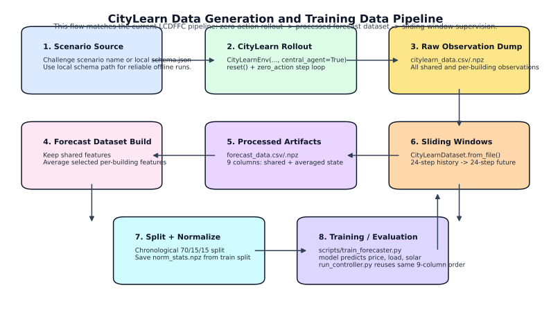
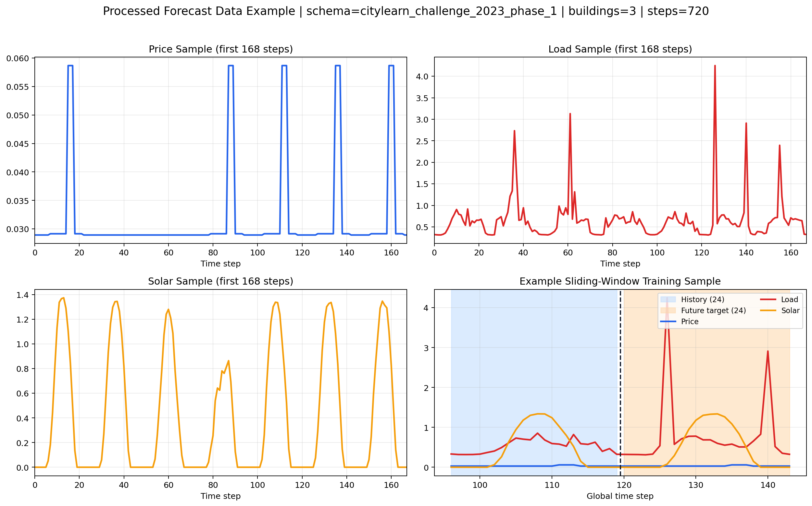

# LCDFFC Data Generation Guide

这份文档解释当前仓库的数据生成链路、主实验集与外部迁移集的场景设置、以及如何从 `CityLearn` 交互中提取可训练的 forecasting 数据。

## 一眼看懂

- 当前训练数据不是外部静态表，而是从 `CityLearnEnv` 回放中采出来的时序数据。
- 当前数据采集策略是 `zero_action`，也就是不给电池额外控制动作，让环境按默认 building behavior 运行。
- 训练输入来自 `forecast_data.npz`，这是从原始 observation 表中筛选和聚合后的 9 列集中式特征。
- 当前默认预测目标只有 3 个：`electricity_pricing`、`non_shiftable_load_avg`、`solar_generation_avg`。
- 离线环境下，最稳妥的做法是传本地 `schema.json` 路径给 `CityLearnEnv` 或 `prepare_citylearn.py`，不要直接传 scenario 名字。



## 当前主实验集与外部迁移集

下表是当前 live 实验计划里实际使用的 8 个场景，以及我在本机上实测到的规模。

| Role | Scenario | Buildings | Time steps | Observation dim | Notes |
|------|----------|----------:|-----------:|----------------:|-------|
| Main | `citylearn_challenge_2023_phase_1` | 3 | 720 | 49 | 当前 `artifacts/` 默认样例来自这里 |
| Main | `citylearn_challenge_2023_phase_2_local_evaluation` | 3 | 720 | 52 | 本地 evaluation split |
| Main | `citylearn_challenge_2023_phase_3_1` | 6 | 2208 | 85 | Phase 3 split 1 |
| Main | `citylearn_challenge_2023_phase_3_2` | 6 | 2208 | 85 | Phase 3 split 2 |
| Main | `citylearn_challenge_2023_phase_3_3` | 6 | 2208 | 85 | Phase 3 split 3 |
| Transfer | `citylearn_challenge_2022_phase_1` | 5 | 8760 | 44 | 一整年小时级仿真 |
| Transfer | `citylearn_challenge_2022_phase_2` | 5 | 8760 | 44 | 一整年小时级仿真 |
| Transfer | `citylearn_challenge_2022_phase_3` | 7 | 8760 | 52 | 一整年小时级仿真 |

这些场景都已经在本机缓存到 `~/.cache/citylearn/v2.3.1/datasets/` 下，并且可以通过本地 `schema.json` 路径直接实例化。

## 整体数据链路

当前数据生成链路与训练链路可以概括成下面这条：

```text
CityLearn scenario / schema.json
  -> CityLearnEnv(schema=..., central_agent=True)
  -> zero_action rollout over the full episode
  -> raw observation table: citylearn_data.csv / citylearn_data.npz
  -> processed centralized forecast table: forecast_data.csv / forecast_data.npz
  -> chronological train/val/test split
  -> sliding windows: 24-step history -> 24-step future target
  -> scripts/train_forecaster.py
```

更具体地说：

1. `data/prepare_citylearn.py` 用 `CityLearnEnv` 跑一个完整 episode。
2. 每步调用 `env.step(zero_action)`，收集 central-agent observation。
3. 保存一份完整的原始 observation 表到 `citylearn_data.*`。
4. 再从原始 observation 中提取共享特征，并把多建筑特征做平均，得到 `forecast_data.*`。
5. `data/dataset.py` 把 `forecast_data.npz` 切成监督学习样本。
6. `scripts/train_forecaster.py` 用这些样本训练 GRU、TSMixer、PatchTST 等 forecasting 模型。

## 如何从 CityLearn 交互中拿数据

当前采集逻辑的关键不是 reward，而是 observation。

最小交互模式大致是：

```python
from citylearn.citylearn import CityLearnEnv

env = CityLearnEnv(schema=schema_path, central_agent=True)
obs = env.reset()

num_actions = len(env.action_names[0])
zero_action = [[0.0] * num_actions]

all_obs = [obs[0][0] if isinstance(obs[0][0], list) else obs[0]]

terminated = False
truncated = False
while not (terminated or truncated):
    obs, reward, terminated, truncated, info = env.step(zero_action)
    all_obs.append(obs[0])
```

这里有两个实现细节要注意：

- 代码使用 `central_agent=True`，所以 observation 是“单个 agent 看到的全局视角”，不是每栋楼单独一条样本。
- central-agent 返回的 observation 结构有嵌套层，当前代码会取 `obs[0]` 或 `obs[0][0]` 再 flatten。

## 当前原始数据与处理后数据的区别

### 原始 observation 表：`citylearn_data.*`

这是完整回放后的原始时序表，包含：

- 全局共享特征，如 `day_type`、`hour`、`outdoor_dry_bulb_temperature`、`carbon_intensity`、`electricity_pricing`
- 每栋楼各自的 `non_shiftable_load`、`solar_generation`、`electrical_storage_soc`、`net_electricity_consumption`
- 某些场景还会带更多预测气象量和附加观测，因此不同 scenario 的 observation 维度不同

### 训练专用表：`forecast_data.*`

这是当前 forecasting 训练和评估共用的核心数据，固定为 9 列：

1. `day_type`
2. `hour`
3. `outdoor_dry_bulb_temperature`
4. `carbon_intensity`
5. `electricity_pricing`
6. `non_shiftable_load_avg`
7. `solar_generation_avg`
8. `electrical_storage_soc_avg`
9. `net_electricity_consumption_avg`

设计原则是：

- 共享特征直接保留
- 多建筑特征按 building 平均，构成 centralized forecasting dataset

这也是为什么当前 forecasting 不是“一栋楼一个模型”，而是“一个 centralized forecaster 预测 district-average target”。

## 当前默认预测目标

当前默认只预测 3 个量：

- `electricity_pricing`
- `non_shiftable_load_avg`
- `solar_generation_avg`

它们在 `forecast_data.npz` 里的列索引是 `[4, 5, 6]`。

这 3 个量会被送给下游 `QP` controller，用来做 forecast-then-control 评估。

## 样例图

下面这张图使用当前工作区中的 `artifacts/forecast_data.npz` 和 `artifacts/data_summary.json` 生成。它包含：

- 前 168 步的 price / load / solar 样例时序
- 一个真实的 `24-step history -> 24-step future` 滑窗样本



## 训练数据是怎么切出来的

`data/dataset.py` 里的 `CityLearnDataset` 会把整条时序切成监督学习样本：

- 输入：过去 `history_len` 步的 9 维特征
- 输出：未来 `horizon` 步的 target 序列

当前默认设置：

- `history_len = 24`
- `horizon = 24`
- `train / val / test = 70% / 15% / 15%`

归一化统计只用训练集计算，并保存在 `norm_stats.npz`。

## 推荐的离线工作流

### 第 1 步：首次把 scenario 缓存到本机

如果本机还没缓存相应数据集，先运行：

```bash
python - <<'PY'
from citylearn.data import DataSet

scenarios = [
    'citylearn_challenge_2023_phase_1',
    'citylearn_challenge_2023_phase_2_local_evaluation',
    'citylearn_challenge_2023_phase_3_1',
    'citylearn_challenge_2023_phase_3_2',
    'citylearn_challenge_2023_phase_3_3',
    'citylearn_challenge_2022_phase_1',
    'citylearn_challenge_2022_phase_2',
    'citylearn_challenge_2022_phase_3',
]

ds = DataSet()
for s in scenarios:
    print(ds.get_dataset(s))
PY
```

第一次运行需要网络；下载完成后，数据会缓存到：

```text
~/.cache/citylearn/v2.3.1/datasets/<scenario_name>/schema.json
```

### 第 2 步：生成某个 scenario 的训练数据

主实验例子：

```bash
python data/prepare_citylearn.py \
  --schema ~/.cache/citylearn/v2.3.1/datasets/citylearn_challenge_2023_phase_2_local_evaluation/schema.json \
  --output_dir artifacts/scenarios/citylearn_challenge_2023_phase_2_local_evaluation
```

迁移例子：

```bash
python data/prepare_citylearn.py \
  --schema ~/.cache/citylearn/v2.3.1/datasets/citylearn_challenge_2022_phase_1/schema.json \
  --output_dir artifacts/scenarios/citylearn_challenge_2022_phase_1
```

这一步会输出：

- `citylearn_data.csv`
- `citylearn_data.npz`
- `forecast_data.csv`
- `forecast_data.npz`
- `data_summary.json`

### 第 3 步：训练 forecasting 模型

```bash
python scripts/train_forecaster.py \
  --config configs/forecast.yaml \
  --data_path artifacts/scenarios/citylearn_challenge_2023_phase_2_local_evaluation/forecast_data.npz \
  --device cuda:0 \
  --seed 42 \
  --suffix _phase2local
```

### 第 4 步：把训练好的模型接回 CityLearn 做 control 评估

```bash
python eval/run_controller.py \
  --schema ~/.cache/citylearn/v2.3.1/datasets/citylearn_challenge_2023_phase_2_local_evaluation/schema.json \
  --checkpoint artifacts/checkpoints/gru_uniform_best_phase2local.pt \
  --norm_stats artifacts/norm_stats.npz \
  --forecast_config configs/forecast.yaml \
  --controller_config configs/controller.yaml \
  --output_dir reports/phase2local \
  --tag gru_qp_phase2local
```

## 已验证的生成样例

我已经在这台机器上实际跑通了两个例子：

- `citylearn_challenge_2023_phase_2_local_evaluation`
  - 输出目录：`/tmp/citylearn_phase2_local`
  - `forecast_data.npz` shape：`(720, 9)`
- `citylearn_challenge_2022_phase_1`
  - 输出目录：`/tmp/citylearn_2022_phase1`
  - `forecast_data.npz` shape：`(8760, 9)`

## 常见坑

- 不要依赖 scenario 名字符串做离线评估。
  在当前环境里，`CityLearnEnv(schema='citylearn_challenge_2023_phase_1')` 仍可能触发在线查询。离线最稳妥的方式是传本地 `schema.json` 路径。
- 不要把多个 scenario 都写回同一个 `artifacts/forecast_data.npz`。
  多场景实验应该按 scenario 单独建目录，例如 `artifacts/scenarios/<scenario_name>/`。
- `norm_stats.npz` 当前是全局路径。
  如果你连续训练多个场景，默认的 `artifacts/norm_stats.npz` 会被覆盖。多场景训练时应单独管理标准化统计。
- observation 维度会随 scenario 变化。
  但 `forecast_data.npz` 的 9 列处理后格式是固定的，这正是 `prepare_citylearn.py` 的作用。
- 当前数据采集轨迹是 `zero_action`。
  也就是说训练数据来自默认 building behavior 下的回放，而不是来自 QP controller 或其他 policy 生成的 closed-loop 轨迹。

## 复现文档中的图

如果你替换了 `artifacts/forecast_data.npz` 或 `artifacts/data_summary.json`，可以重新生成图：

```bash
python docs/tmp_scripts/generate_data_generation_figures.py \
  --forecast-data artifacts/forecast_data.npz \
  --data-summary artifacts/data_summary.json \
  --output-dir docs/assets
```
